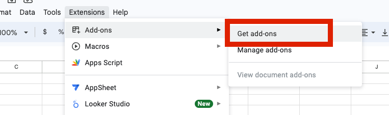
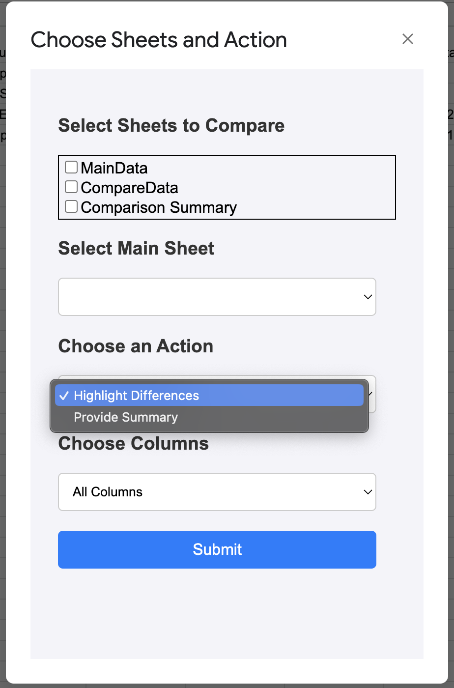
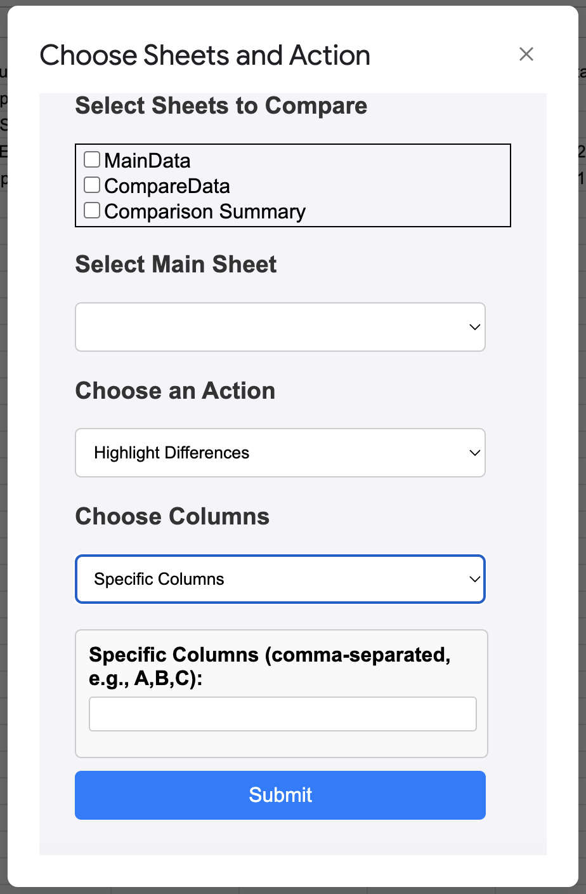
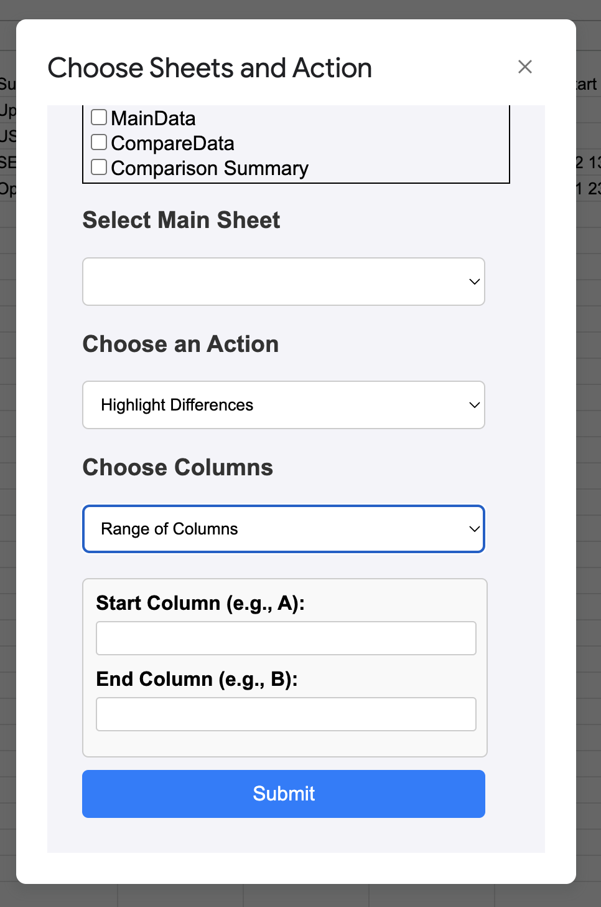
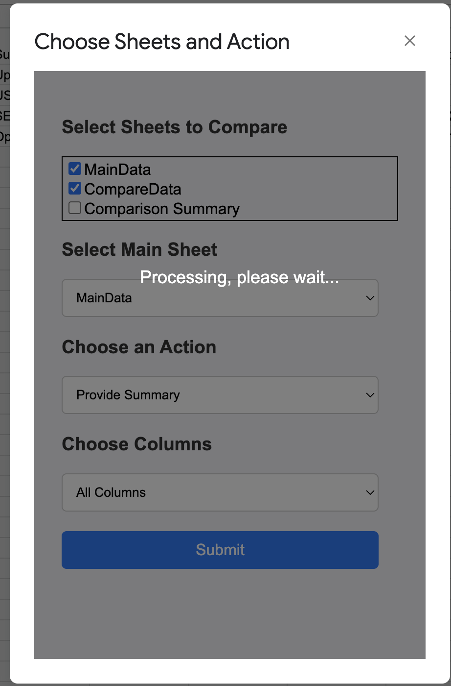

# Compare Sheets for Difference Values in Spread Sheet Extension

A brief description of what this project does and who it's for

## Publish Extension
https://youtu.be/4MN33QUkc9Y

## Installation

    1. Go to Google Sheets and open any existing spreadsheet or create a new one.
    2. Click on the Extensions menu at the top of the Google Sheets interface.
    3. Select Add-ons > Get add-ons.
    4. In the Google Workspace Marketplace, use the search bar to look for "Compare Sheets" and click internal.
    5. Click on the Compare Sheets add-on from the search results.
    6. Click the Install button and follow the on-screen instructions to authorize the add-on.
You may be prompted to authorize the add-on to access your Google Sheets. Click Allow to grant the necessary permissions.

## Usage/Examples

    1. In your Google Sheets document, go to Extensions > Compare Sheets > Start.
    2. Select the sheet you want to compare.
    3. Select the main sheet against which other sheets will be compared.
    4. Choose Action:
        a. Highlight Differences: This option will highlight the differences between the main sheet and the selected sheet.
        b. Provide Summary: This option will create a summary sheet that shows the differences. The summary sheet can be created automatically or you can clear existing data.
    5. Choose Columns:
        a. All Columns: Compare all columns to find differences.
        b. Range of Columns: Input the start and end columns you want to compare.
        c. Specific Columns: Compare specific columns by entering them as a comma-separated list.
    6. Click Submit and Wait.

## Sceeenshoot

## Notes
    1. Differences in non-main sheets will be highlighted with a yellow background.
    s2. Provide Summary will create new sheet, name is "comparison summary"